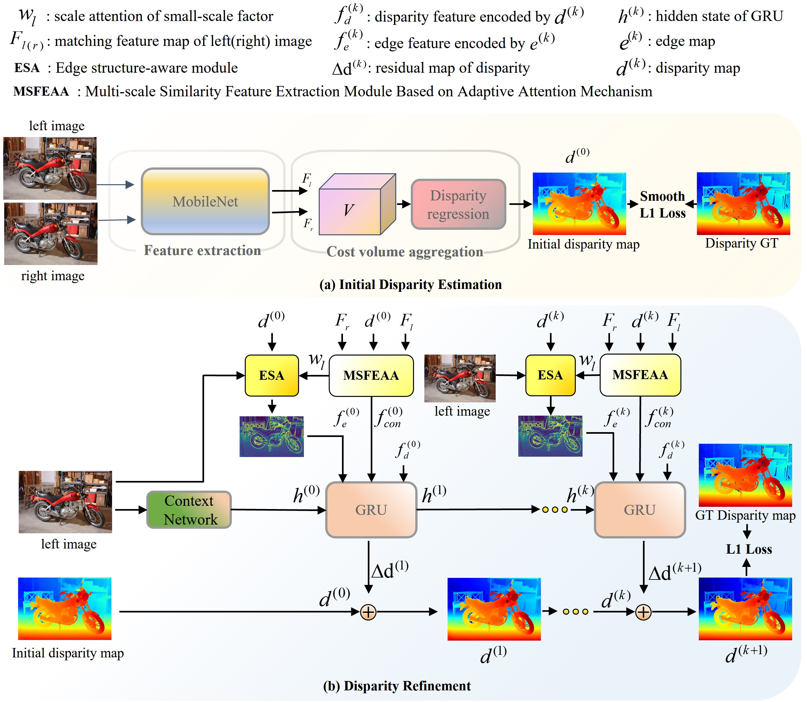

# Eglcr

# Eglcr: Edge Structure Guidance and Scale Adaptive Attention for Iterative Stereo Matching




### Create a virtual environment and activate it.

```
conda create -n EGLCR python=3.8
conda activate EGLCR
```
### Dependencies

```
conda install pytorch torchvision torchaudio cudatoolkit=11.7 -c pytorch -c nvidia
conda activate EGLCR

pip install opencv-python
pip install scikit-image
pip install tensorboard
pip install matplotlib 
pip install tqdm
pip install timm==0.5.4
```


## Citation

If you find our work useful in your research, please consider citing our paper:

```bibtex
@inproceedings{dai2024eglcr,
  title={Eglcr: Edge Structure Guidance and Scale Adaptive Attention for Iterative Stereo Matching},
  author={Dai, Zhien and Tang, Zhaohui and Zhang, Hu and Tian, Can and Pan, Mingjun and Xie, Yongfang},
  booktitle={Proceedings of the 32nd ACM International Conference on Multimedia},
  pages={4197--4206},
  year={2024}
}
```

# Acknowledgements

This project is based on [RAFT-Stereo](https://github.com/princeton-vl/RAFT-Stereo), and [CoEx](https://github.com/antabangun/coex). We thank the original authors for their excellent works.

